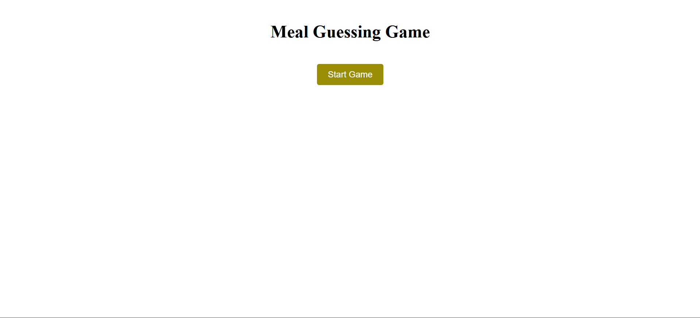
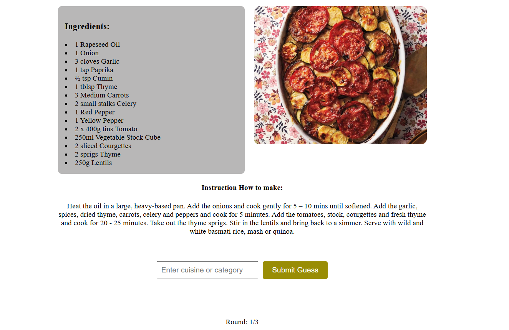
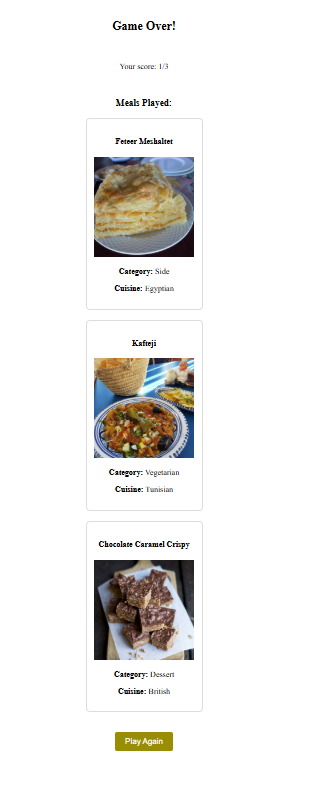

# 🍽️ Meal Guessing Game

A fun web game where User guess the cuisine or category of random meals fetched from TheMealDB API.

## 🎮 Features

- Random meal fetched from TheMealDB API
- Visual display of meal images and ingredients and instructions
- Three-round gameplay with score tracking
- Immediate feedback on guesses
- End-game summary with revealed meals

## 🛠️ Technologies Used

- HTML
- CSS
- JavaScript
- TheMealDB API

## How to Fully Set Up the Repository Locally & Running the Game.

To set up this repository on your local machine, follow these steps:

1. **Clone the Repository**:
   Open your terminal and run the following command to clone the repository:
   ```bash
   git clone https://github.com/Moringa-SDF-PT10/valentine-wabwire-meal-project
   ```
2. **Navigate to the Repository Directory**:
   ```bash
   cd valentine-wabwire-meal-project
   ```
3. **Run the Application** Open the index.html file in your browser, or use a local development server like [Open with Live server](vscode:extension/ritwickdey.LiveServer)

## Once you visit the link opened on browser you will see below:

  

## 🌐Live Demo

[Play the Game](https://moringa-sdf-pt10.github.io/valentine-wabwire-meal-project/)

## 🎯 How to Play

1. Click "Start Game" to begin
2. Examine the displayed meal image and ingredients
3. Guess the cuisine (e.g., Italian, Mexican) or category (e.g., Dessert, Seafood)
4. Receive immediate feedback on your guess
5. Play through 3 rounds
6. View your final score and meal summaries
7. Click "Play Again" to restart

# 🤝 Contributing

Contributions are welcome! Please fork the repository and create a pull request with your improvements.
